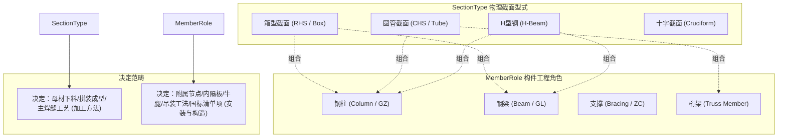
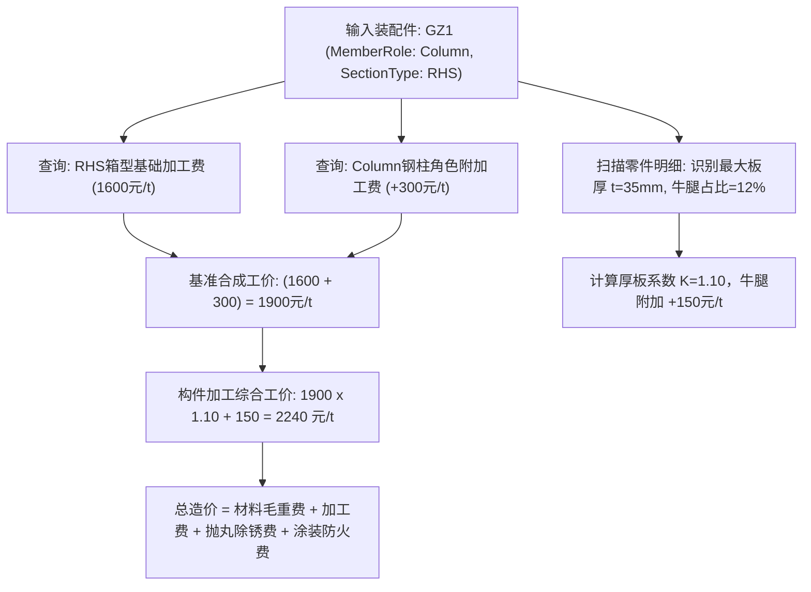

# 钢结构加工定额数据库、构件级装配组价(BOM)与BIM结算比对系统规划 (修订版 v2.0)

## 一、方案背景与核心命题 (Goal & Core Hypothesis)

在首版规划基础上，用户提出了一个至关重要的钢结构领域核心设计原则：
> **原则确认：** 总体采用 **“选项 A：构件综合定额法”**（兼具工程实用性与计算效率）。  
> **核心修订：** **构件类型（工程角色）不等于截面特性，二者必须解耦为两个独立的正交字段！**  
> 例如：同样的“焊接箱型截面”，它既可以是“钢柱”（箱型柱），也可以是“钢梁”（箱型梁）。它的工厂下料组装主工艺（加工方法）几乎是一致的，但后续的安装吊装方法、内部构造（如箱型柱内部有电渣焊内隔板与牛腿，而箱型梁通常没有）完全不同。

本修订版方案围绕这一核心洞察，对领域模型、定额核算矩阵、BOM 装配结构与 BIM 对账引擎进行全方位深度重构。

---

## 二、工程深度解析：“构件角色”与“截面特性”的双字段解耦哲学

在钢结构制造、深化设计（Tekla/Revit）与工程造价中，构件对象必须由两个正交维度共同定义：



### 1. 维度职责对照矩阵 (Dimension Comparison)

| 观察维度 | 字段一：截面特性 (`SectionType`) | 字段二：构件工程角色 (`MemberRole`) |
| :--- | :--- | :--- |
| **物理本质** | 构件主肢的几何断面形状与焊接形式 | 构件在空间建筑力学体系中的功能定位 |
| **枚举示例** | 箱型 (RHS)、圆管 (CHS)、H型钢 (HBeam)、十字型 (Cruciform)、角钢 (Angle) | 框架柱 (Column)、框架梁 (Beam)、系杆/支撑 (Bracing)、桁架弦杆 (TrussMember) |
| **车间制造影响** | **主工艺基准线**：板材下料数控切割、组立机拼对、龙门埋弧焊纵向主焊缝、热矫正 | **附属工时附加**：内部有无隔板、外部有无牛腿、端板钻孔、起拱度 |
| **现场安装影响** | 吊装索具与夹具选择（如圆管用吊带、箱型焊临时吊耳） | **现场施工定额**：垂直立柱对中纠偏 vs 高空水平梁就位 vs 斜支撑穿插 |
| **造价清单影响** | 车间成本核算、原材料排产采购明细（按钢板/型钢汇总） | 国标清单编码（010605 钢柱、010606 钢梁、010607 钢屋架等） |

### 2. 交叉组合实例剖析 (Why Orthogonality Matters)

以用户特别提及的“焊接箱型”与“圆管”为例：
1. **箱型截面 (RHS) $\times$ 钢柱 (Column) = 箱型柱 (Box Column)**
   * **加工工法**：四块钢板下料 $\to$ 组拼U型 $\to$ **关键工序：组装内部多道熔透内隔板（电渣压力焊/衬板单面焊）** $\to$ 盖上盖板 $\to$ 四道主焊缝自动埋弧焊 $\to$ **关键工序：四向外伸梁牛腿装配与坡口全熔透焊接** $\to$ 柱底承压板与柱脚加劲肋组对。
   * **综合定额**：主工艺 + 内隔板工时 + 牛腿节点加成 $\implies$ 加工费约 **2200 ~ 2600 元/吨**。
   * **安装工法**：重型立柱垂直吊装，柱底锚栓调整水平与标高。
2. **箱型截面 (RHS) $\times$ 钢梁 (Beam) = 箱型梁 (Box Girder)**
   * **加工工法**：四块板下料 $\to$ 组装U型 $\to$ 隔板通常仅位于端部支座处 $\to$ 封盖板 $\to$ 四道纵缝埋弧焊 $\to$ 矫正 $\to$ 按设计跨中起拱（Camber） $\to$ 两端焊接高强螺栓端板。
   * **综合定额**：无密集内隔板与牛腿，加工费约 **1700 ~ 2000 元/吨**（显著低于箱型柱）。
   * **安装工法**：双机抬吊或高空平吊就位，两端抗剪与抗弯节点拼接。
3. **圆管截面 (CHS) $\times$ 钢柱 (Column) vs 圆管截面 (CHS) $\times$ 桁架杆件 (TrussMember)**
   * **圆管柱**：管件接长 + 柱顶承托板 + 柱脚锚栓环形肋板 + 灌混凝土透气孔（约 1800 元/吨）；
   * **圆管桁架杆**：需要五轴数控**相贯线切口（Saddle Cut）**，相贯相交坡口组焊难度极高，按相贯节点工时定额（约 2400 ~ 2900 元/吨）。

---

## 三、双字段解耦领域模型重构 (Refactored Domain Architecture)

### 1. 核心枚举与正交模型定义

```csharp
namespace EngineeringApp.Shared.Models;

/// <summary>
/// 构件在空间建筑结构中的工程功能角色 (决定安装定额、清单归类与附属节点特征)
/// </summary>
public enum MemberRole
{
    Column,             // 框架钢柱 / 抗风柱 / 门架刚架柱 (GZ / KFZ)
    Beam,               // 框架主梁 / 楼层次梁 / 悬挑梁 / 吊车梁 (GL / CL / DL)
    Bracing,            // 柱间支撑 / 屋面水平支撑 / 系杆 (ZC / SC / XG)
    TrussChord,         // 空间桁架弦杆 (上弦/下弦)
    TrussWeb,           // 空间桁架腹杆 (斜腹杆/竖腹杆)
    CantileverBracket,  // 独立悬臂牛腿 / 托架 / 挑檐
    PurlinGirth,        // 檩条 / 墙梁次结构 (C/Z型钢)
    Miscellaneous       // 楼梯 / 平台 / 栏杆 / 预埋件
}

/// <summary>
/// 构件装配层级模型 (Assembly / Mark Node, 如 GZ1 或 GL1)
/// </summary>
public class SteelAssemblyItem
{
    public string AssemblyId { get; set; } = Guid.NewGuid().ToString("N")[..8];
    public string AssemblyMark { get; set; } = "GZ1"; // 构件编号，如 GZ1, GL1, ZC1

    // ================= 正交双字段核心 =================
    /// <summary>字段一：构件工程角色 (清单与安装维度)</summary>
    public MemberRole Role { get; set; } = MemberRole.Column;

    /// <summary>字段二：主肢物理截面类型 (母材制造与截面力学维度)</summary>
    public SectionType MainSectionType { get; set; } = SectionType.RHS;

    /// <summary>工程总套数/根数</summary>
    public int Quantity { get; set; } = 10;

    /// <summary>构件总长度/标高跨度 (m)</summary>
    public double OverallLengthMeter { get; set; } = 6.0;

    /// <summary>所属图纸子项 / 建筑楼层标高分区</summary>
    public string FloorOrZone { get; set; } = "1F-4F 标高区间";

    /// <summary>装配件包含的所有内部板件/零件清单 (BOM Leaf Nodes)</summary>
    public List<SteelPartItem> Parts { get; set; } = [];

    // ================= 物理指标汇总 =================
    /// <summary>单根构件净重 (kg)</summary>
    public double SingleAssemblyNetWeightKg => Parts.Sum(p => p.NetWeightKg * p.QuantityPerAssembly);

    /// <summary>单根构件采购毛重 (kg)</summary>
    public double SingleAssemblyGrossWeightKg => Parts.Sum(p => p.GrossWeightKg * p.QuantityPerAssembly);

    /// <summary>单根构件展开涂装外表面积 (m²)</summary>
    public double SingleAssemblyPaintingAreaM2 => Parts.Sum(p => p.NetSurfaceAreaM2 * p.QuantityPerAssembly);

    /// <summary>节点板/牛腿等配件重量占整构件比例 (%)</summary>
    public double FittingWeightRatio => SingleAssemblyNetWeightKg <= 0 ? 0 :
        (Parts.Where(p => p.Role != PartFunctionalRole.MainProfile).Sum(p => p.NetWeightKg * p.QuantityPerAssembly) / SingleAssemblyNetWeightKg) * 100.0;
}
```

### 2. 零件/板件级模型 (`SteelPartItem`)

构件是由零件组成的。一个 `GZ1` 箱型柱由如下不同截面的零件拼装而成：
* **主肢**：`RHS` 箱型截面（$800 \times 800 \times 25$）；
* **牛腿**：`HBeam` 截面（$HN400 \times 200 \times 8 \times 13$）；
* **内隔板**：`Plate` 矩形钢板（厚度 $30\text{mm}$）；
* **柱脚底板**：`Plate` 承压钢板（厚度 $40\text{mm}$）。

```csharp
namespace EngineeringApp.Shared.Models;

/// <summary>
/// 零件在装配构件中的细分功能分类
/// </summary>
public enum PartFunctionalRole
{
    MainProfile,        // 主肢型钢 / 主筒体
    BracketBeam,        // 牛腿梁段 (如 H型钢梁段牛腿)
    Diaphragm,          // 箱型柱内隔板 (需电渣压力焊与透气切角)
    BasePlate,          // 柱底承压板 / 支座垫板
    StiffenerRib,       // 加劲肋板 / 加强板
    ConnectionPlate,    // 节点连接板 / 剪切角钢
    SplicePlate,        // 柱梁工地拼接连接耳板
    LiftingLug          // 工艺吊装吊耳
}

/// <summary>
/// 零件/板件明细实体 (Part / BOM Leaf Node)
/// </summary>
public class SteelPartItem
{
    public string PartId { get; set; } = Guid.NewGuid().ToString("N")[..8];
    public string PartMark { get; set; } = "p1"; // 零件编号，如 m1(主肢), br1(牛腿), dp1(隔板)
    public PartFunctionalRole Role { get; set; } = PartFunctionalRole.MainProfile;
    public string PartName { get; set; } = "箱型主肢";

    /// <summary>该零件的物理截面型式 (箱型、H型、圆管、平板等)</summary>
    public SectionType SectionType { get; set; } = SectionType.RHS;

    /// <summary>截面几何参数 (复用现有 SectionParameters 算法体系)</summary>
    public SectionParameters? Section { get; set; }

    /// <summary>主要板厚 (mm)</summary>
    public double ThicknessMm { get; set; } = 25.0;

    /// <summary>零件长度 (m)</summary>
    public double LengthMeter { get; set; } = 6.0;

    /// <summary>单件净重量 (kg)</summary>
    public double NetWeightKg { get; set; }

    /// <summary>单件涂装外表面积 (m²)</summary>
    public double NetSurfaceAreaM2 { get; set; }

    /// <summary>单根装配构件内包含的本零件数量</summary>
    public int QuantityPerAssembly { get; set; } = 1;

    /// <summary>下料损耗率 (如 0.05 代表 5%)</summary>
    public double PartLossRate { get; set; } = 0.05;

    /// <summary>零件毛重 (kg)</summary>
    public double GrossWeightKg => NetWeightKg * (1.0 + PartLossRate);
}
```

---

## 四、选项 A（构件综合定额）正交组价算法设计

### 1. 二维正交定额库结构 (`FabricationQuotaDatabase`)
采用选项 A 时，综合单价由 `(SectionType, MemberRole)` 联合决定，辅以板厚与节点加权：

$$ \text{综合制作单价 (元/t)} = \left[ P_{\text{Base}}(\text{SectionType}) + \Delta P_{\text{Role}}(\text{MemberRole}) \right] \times K_{\text{Thick}}(t) + \Delta P_{\text{Fitting}} $$

* $P_{\text{Base}}(\text{SectionType})$：**截面制造基准工费**（如焊接箱型 1600元/t，焊接H型 1100元/t，热轧型钢 500元/t，圆管 1700元/t）；
* $\Delta P_{\text{Role}}(\text{MemberRole})$：**构件角色附加调节项**（如柱增加内隔板与牛腿装配工费 +300元/t，桁架增加相贯线装配工费 +500元/t，平梁为 0元/t）；
* $K_{\text{Thick}}(t)$：**厚板难度系数**（$t \le 25\text{mm}$ 时为 1.0；$25 < t \le 40\text{mm}$ 为 1.10；$t > 40\text{mm}$ 为 1.25，考虑预热焊与消氢）；
* $\Delta P_{\text{Fitting}}$：**节点复杂程度加成**（根据牛腿数量及节点板占重比例动态加权）。



### 2. 双向透视统计能力（制造业 vs 造价业）
这一正交模型赋予软件极其强悍的统计报表输出能力：
* **报表视角 A：车间下料生产排产单（按 `SectionType` 统计）**
  * 焊接箱型构件总重：$X$ 吨（通知四板数控切割与自动埋弧焊车间）；
  * 焊接H型钢构件总重：$Y$ 吨（通知H型组立与门焊车间）；
  * 圆管构件总重：$Z$ 吨（通知数控相贯线切割车间）。
* **报表视角 B：业主工程量清单与安装报表（按 `MemberRole` 统计）**
  * 010605 钢柱清单项：总重 $A$ 吨，安装单价 $M$ 元/吨（包含全部箱型柱、圆管柱、H型柱）；
  * 010606 钢梁清单项：总重 $B$ 吨，安装单价 $N$ 元/吨；
  * 010607 钢屋架/支撑：总重 $C$ 吨。

---

## 五、BIM 模型结算与审计比对体系 (BIM vs Bid Settlement Audit)

### 1. 为什么双字段解耦让 BIM 对接变得自然？
在国际通用的 BIM 数据标准中：
* **IFC 标准中**：
  * `IfcColumn` / `IfcBeam` / `IfcMember` $\equiv$ `MemberRole`（构件工程角色）；
  * `IfcProfileDef`（`IfcIShapeProfileDef`, `IfcRectangleHollowProfileDef`） $\equiv$ `SectionType`（截面物理型式）。
* **Tekla Structures 工业模型中**：
  * `Assembly.Prefix`（如 GZ, GL, SC） $\equiv$ `MemberRole`；
  * `MainPart.Profile`（如 BOX800\*800\*25） $\equiv$ `SectionType`；
  * `Assembly.Parts` $\equiv$ `SteelPartItem`。

因为我们在数据模型层已经完全对齐，因此无论用户导入 Tekla 导出的构件材料清单，还是 Revit 的明细表，都可以**零损耗、零猜测地精准映射**！

### 2. BIM 结算比对维度表
```mermaid
graph LR
    subgraph 前期报价库 (Bid Estimates)
        BidAssembly["GZ1 (箱型柱): 预估重量 3.20t, 涂装面积 18.5m²"]
    end

    subgraph 深化BIM模型 (Tekla / Revit)
        BimAssembly["GZ1 (箱型柱): 实际重量 3.42t, 涂装面积 19.1m²"]
    end

    BidAssembly <--> |构件编号对账| BimAssembly
    
    DiffResult["偏差分析: 重量 +6.8% (牛腿加厚加劲), 面积 +3.2%"]
    DiffResult --> PriceVariance["综合造价差额: 结算总价追加 +4,820 元"]
    PriceVariance --> StatusAlert["状态: 【黄色注意】(节点板增重导致偏差)"]
```

---

## 六、演进路线与实施计划 (Implementation Roadmap)

### 阶段 1：领域模型与正交加工定额库落地
* 在 `EngineeringApp.Shared/Models/` 创建 `MemberRole.cs`、`SteelAssemblyItem.cs`、`SteelPartItem.cs` 与 `FabricationQuotationModels.cs`；
* 在 `EngineeringApp.Shared/Data/` 建立 `FabricationQuotaDatabase.cs`（初始化箱型、圆管、H型在不同构件角色下的基准定额与附加系数）；
* 在 `EngineeringApp.Server` 的 `AppDbContext.cs` 中增加持久化实体并配置 SQLite。

### 阶段 2：构件级组价引擎 (`FabricationCostCalculator`)
* 编写纯 C# 算法类，实现：
  1. 构件内多板件（主肢 + 牛腿 + 隔板 + 柱脚板）的几何特性与物理量汇总；
  2. 基于 `(MemberRole, SectionType)` 的双维度综合单价核算；
  3. 联动涂装防腐防火系统（复用现有 `PaintProductDatabase`）。
* 在 `EngineeringApp.Tests` 中编写自动化单元测试，验证计算精度。

### 阶段 3：Blazor 树形构件组价工作台
* 在客户端提供可视化工作台，支持树形展开：
  * `[+] GZ1 (框架柱 | 焊接箱型) - 10根 - 单件重 3.25t - 综合单价 7,850元/t`
    * `└── 主肢: RHS 800x800x25`
    * `└── 牛腿: HBeam 400x200x8x13 (数量: 2)`
    * `└── 内隔板: 30mm 钢板 (数量: 4)`
    * `└── 柱底承压板: 40mm 钢板 (数量: 1)`
* 支持即时修改板厚或增减牛腿，右侧看板实时响应造价变化。

### 阶段 4：BIM 结算比对与审计看板
* 构件级量差、表面积差、综合单价差对比表格；
* 智能偏差预警状态（绿色匹配、黄色注意、红色超限）；
* 一键导出工程对账审计汇总报告。

---

## 七、验证方案 (Verification Plan)

### 1. 自动化单元测试 (`EngineeringApp.Tests`)
* **测试用例 1 (正交定额正确性)**：验证同一箱型截面在 `MemberRole.Column` 与 `MemberRole.Beam` 下加工定额的合理差异；
* **测试用例 2 (装配件物理量汇聚)**：验证主肢箱型柱装配 2 个 H 型钢牛腿与 4 块内隔板后的总净重、总毛重、外表面积计算；
* **测试用例 3 (厚板与牛腿修正)**：验证当主肢板厚超过 30mm 时，厚板惩罚系数是否准确生效；
* **测试用例 4 (BIM 比对偏差算法)**：验证当模型重量与报价重量产生差异时，偏差率计算与状态判定是否准确。

### 2. 界面交互验收
* 打开工作台，切换构件角色（柱 vs 梁）与截面类型（箱型 vs H型），观察基准定额工费是否正确联动切换；
* 展开/折叠构件板件明细，检查数据汇总响应速度；
* 模拟导入 BIM 结算数据，核验对账差异高亮与审计统计。
