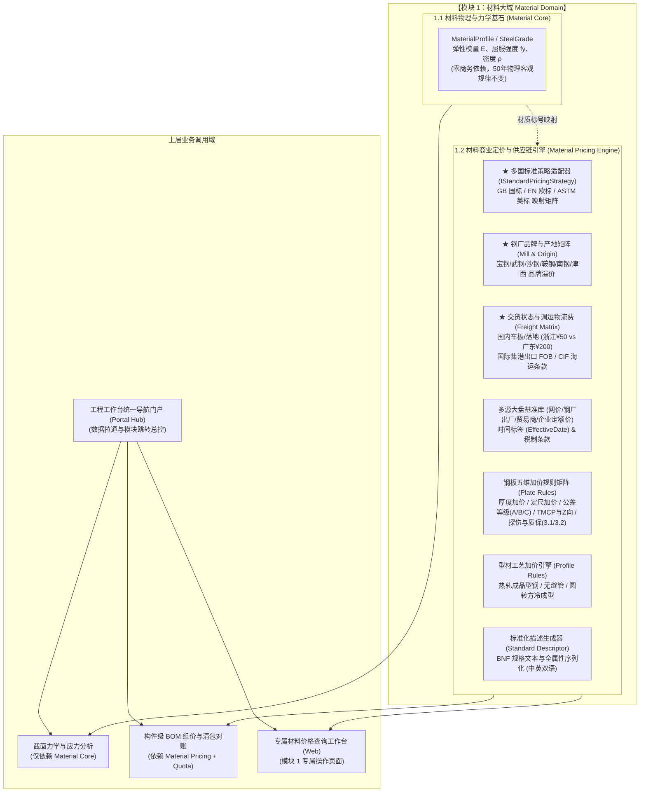
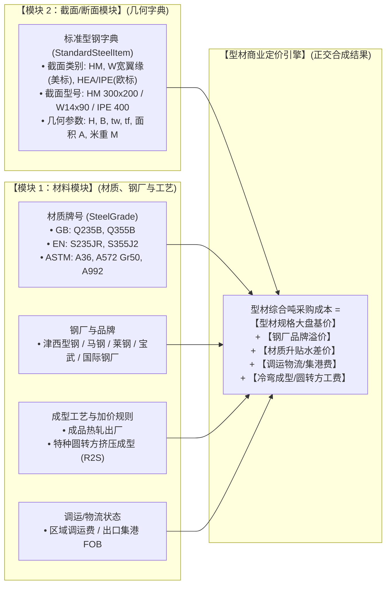
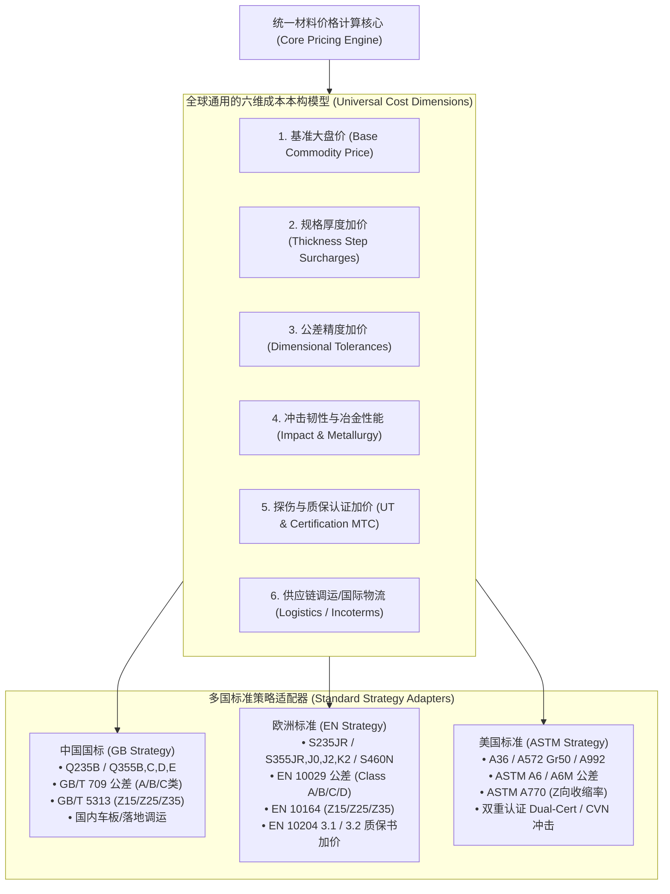
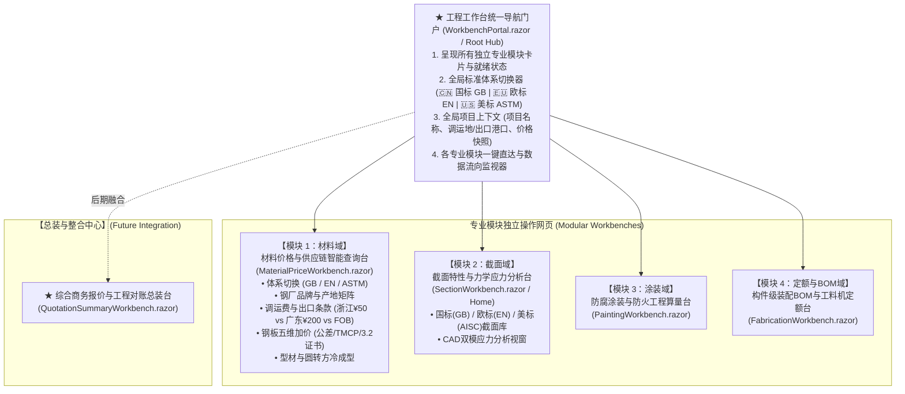
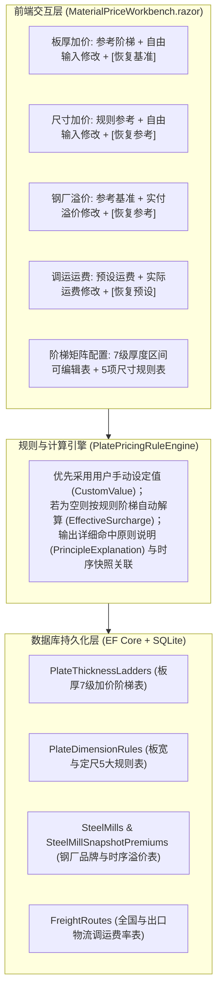

# 钢结构材料域 (Material Domain) 价格体系与深度全盘规划方案 (修订版 v4.0)

## 一、方案目标与核心判断 (Goal & Architectural Judgments)

在钢结构工程算量、深化设计与商务招投标中，材料采购直接费通常占工程总直接费的 60%~75%。基于用户的最新审查意见，我们在原有物理与商业解耦模型基础上，深度补全了工程采购实务中最关键的商务因子，并正式确立了**面向中国国标 (GB)、欧洲标准 (EN) 及美国标准 (ASTM) 的多标准兼容演进架构**。

---

### 核心研判 1：材料价格数据应独立为子模块还是与材料放在一起？

> **【明确判断】：在物理大域上统属于 `Material`，但在分层架构上做“物理力学基石”与“商业价格引擎”的彻底解耦！**



#### 为什么必须解耦？
* 钢材物理力学属性只关心它是 $Q355B$ 还是 $S355JR$，其物理规律数十年不变；
* 商业采购上，大盘基准、钢厂品牌、调运距离以及各国标准的公差与质保认证加价每天每周都在浮动。解耦后，无论是国标还是海外美标欧标项目，力学引擎均无需变更一行代码。

---

### 核心研判 2：型材报价应该放在“截面/断面库”还是“材料域”？

> **【深度剖析与归类原则】：截面库管“几何字典与力学属性”，材料定价域管“商业加价、材质差异与成型工艺”。型材最终单价是二者的正交合成！**



---

## 二、国际化标准架构：美标 (ASTM) 与欧标 (EN) 兼容演进方案

> **【核心结论】：当未来涉及美标、欧标时，整套系统绝不需要推倒换掉！**  
> 因为全球重工业界关于钢材采购的**“物理本构规律”**与**“商业成本模型（基价 + 尺寸加价 + 性能加价 + 精度加价 + 检验加价 + 物流）”在数学和拓扑结构上是完全同构（Isomorphic）的**！



### 1. 三国标准核心维度等效映射矩阵 (Equivalence Mapping)

| 观察维度 | 中国国标 (GB / GB/T) | 欧洲标准 (EN 10025 等) | 美国标准 (ASTM / AISC) | 架构抽象与系统处理方式 |
| :--- | :--- | :--- | :--- | :--- |
| **主打材质牌号** | **Q235B** (普碳)<br/>**Q355B/C/D** (高强)<br/>**Q420B** (超强) | **S235JR**<br/>**S355JR / S355J2**<br/>**S460N / S460M** | **A36** (普碳)<br/>**A572 Grade 50**<br/>**A992** (型钢专用高强) | 共享底层 `YieldStrength`（235/355/345 MPa）物理本构，商务上维护对应标准的基价基准。 |
| **冲击功与质量等级** | • B级 (常温 20℃)<br/>• C级 (0℃)<br/>• D级 (-20℃)<br/>• E级 (-40℃) | • JR (常温 20℃ 27J)<br/>• J0 (0℃ 27J)<br/>• J2 (-20℃ 27J)<br/>• K2 (-20℃ 40J) | • 常规无强制要求 (基准)<br/>• CVN (夏比V型缺口冲击补做加价，如 20 ft·lbf @ -20°F) | 抽象为 `ImpactTestingRequirement`。根据温度要求自动映射加价档位（0℃、-20℃、-40℃）。 |
| **厚度公差与精度** | **GB/T 709**<br/>• A类 (常规负偏差)<br/>• B类 (严控 -0.3mm)<br/>• C类 (保全厚度，无负偏差) | **EN 10029**<br/>• Class A (常规公差)<br/>• Class B (固定下限 -0.3mm)<br/>• **Class C (保全厚度，下限为0)**<br/>• Class D (对称公差) | **ASTM A6 / A6M**<br/>• Table A1.1 Permissible Variations (常规下偏差 0.01英寸/0.3mm)<br/>• 限制厚度公差订货附加 | **惊人的一致性**：GB/T 709 本身就是等效采标 ISO/EN 10029！Class A/B/C 的规则完全一致，零迁移成本。 |
| **Z向抗层状撕裂** | **GB/T 5313**<br/>• Z15 ($\ge 15\%$)<br/>• Z25 ($\ge 25\%$)<br/>• Z35 ($\ge 35\%$) | **EN 10164**<br/>• Z15 ($\ge 15\%$)<br/>• Z25 ($\ge 25\%$)<br/>• Z35 ($\ge 35\%$) | **ASTM A770 / A770M**<br/>• 20% Reduction of Area<br/>• 25% Reduction of Area<br/>• 30% Reduction of Area | 共享 `ZDirectionReduction` 枚举（None, Z15, Z25, Z35），自动匹配对应标准的试验费与加价值。 |
| **控轧与热处理** | • 热轧 (AR)<br/>• 正火 (Normalized)<br/>• TMCP (热机械控轧) | • +AR (As-rolled)<br/>• +N (Normalized rolled)<br/>• +M (Thermomechanical TMCP) | • As-Rolled<br/>• Normalized (ASTM A673)<br/>• TMCP | 统一抽象为 `MetallurgyCondition` 内部枚举，输出时自动格式化为标准后缀（如 `Q355ND` 或 `S355J2+N`）。 |
| **★ 特殊质保认证**<br/>(海外项目核心加价) | 钢厂材质证明书 MTC<br/>(常规 0 加价) | **EN 10204 检验文件**：<br/>• **3.1 证书** (钢厂质检出具，常规)<br/>• **3.2 证书** (需第三方国际机构 BV/DNV/TÜV 见证签署，**加价 +350~600元/吨**) | **CMTR (Certified Mill Test)**<br/>• 双重认证 (Dual-Certified A36/A572-50 加价)<br/>• 独立见证检测加价 | 新增 `InspectionCertificateType`：对海外出口项目精准核算 3.2 机构见证费。 |
| **计价货币与贸易术语** | 人民币 (CNY 元/吨)<br/>车板交货 / 到工地交货 | 美元 (USD/MT 或 欧元 EUR/MT)<br/>**FOB 出口集港 / CIF 目的港** | 美元 (USD/MT 或 美分/磅 cwt)<br/>FOB / CIF / DDP | 扩展支持国际贸易术语（Incoterms）与汇率换算。 |

---

### 2. 标准体系策略模式设计 (`IStandardPricingStrategy`)

为了避免未来重复造轮子，我们在架构层设计策略接口：

```csharp
public enum StandardSystem
{
    GB,    // 中国国标 (GB / GB/T)
    EN,    // 欧洲标准 (EN 10025 / EN 10029)
    ASTM   // 美国标准 (ASTM A36, A572, A992 / ASTM A6)
}

public interface IStandardPricingStrategy
{
    StandardSystem System { get; }
    
    // 材质牌号与冲击加价适配
    double GetImpactGradeSurcharge(SteelGrade grade);
    
    // 公差等级加价适配 (GB Class C <=> EN 10029 Class C)
    double GetToleranceClassSurcharge(ToleranceClass tolerance);
    
    // Z向性能加价适配 (Z15, Z25, Z35)
    double GetZDirectionSurcharge(ZDirectionQuality zQuality);
    
    // 质保与认证加价 (如 EN 10204 3.2 证书加价)
    double GetCertificationSurcharge(InspectionCertificateType certType);
    
    // 生成对应标准的本地化 Describe 规格字符串 (中/英文)
    string BuildStandardSpecificationString(StandardMaterialItemPrice item);
}
```

---

## 三、钢厂品牌与产地矩阵 (Steel Mill & Brand Matrix)

### 1. 钢厂梯队与产地基地字典 (`SteelMillBrand`)

| 梯队与分类 | 钢厂品牌名称 | 主要生产基地 (产地) | 优势产品与工程定位 | 相对大盘溢价 (元/吨) |
| :--- | :--- | :--- | :--- | :--- |
| **第一梯队 (头部央企/龙头)** | **宝武集团 (宝钢股份)** | 上海宝山、广东湛江、江苏梅山 | 中厚板极品、TMCP、Z向特厚板、高端涂镀板 (重大公建必选) | **+150 ~ 280** |
| | **宝武集团 (武钢有限)** | 湖北武汉 | 低合金高强板、重轨、大型型材 | **+80 ~ 150** |
| | **宝武集团 (马钢股份)** | 安徽马鞍山 | **国内热轧 H 型钢老牌领军钢厂** (全规格系列) | **+60 ~ 120** |
| | **鞍钢 / 本钢集团** | 辽宁鞍山、本溪、营口鲅鱼圈 | 东北/北方重型中厚板、桥梁板、海工钢 | **+60 ~ 130** |
| | **首钢股份** | 河北迁安、京唐曹妃甸 | 高强度宽厚板、汽车与结构双高用钢 | **+80 ~ 150** |
| **中厚板特钢龙头** | **南钢 (南京钢铁)** | 江苏南京 | **国内建筑中厚板与耐候钢龙头**、探伤保级能力极强 | **+100 ~ 200** |
| | **华菱钢铁 (湘钢)** | 湖南湘潭 | 超宽厚板、高层建筑抗震钢、海工与风电板 | **+80 ~ 160** |
| **大型民营/区域龙头** | **沙钢集团 (江苏沙钢)** | 江苏张家港 (沙钢基地) | 华东普板/热卷龙头、发货极快、民营集采主力 | **0 ~ +50 (基准)** |
| **型钢专业霸主** | **津西钢铁 (河北津西)** | 河北唐山迁西 | **中国热轧 H 型钢产量最大、规格最全的型钢专业厂** | **0 ~ +60 (型钢基准)** |

---

## 四、交货状态与物流调运费矩阵 (Delivery State & Freight Matrix)

### 1. 三级交货状态模型 (`DeliveryCondition`)
1. **钢厂出厂车板价 (`ExWorks_Mill`)**：钢厂货台上车，不含干线运输费用。
2. **到加工厂落地库房交货价 (`Delivered_FabricationPlant`)**：运抵钢构构件制造车间，含干线运费及卸车下力费。
3. **到工程项目施工现场直抵价 (`Delivered_JobSite`)**：直达工地，含夜间进场卸车与短驳费。
4. **国际出口离岸港口集港价 (`FOB_ChinesePort`)**：运抵上海港/张家港/天津港，含陆运集港、港杂费与出口海运绑扎费（通常加价 **160~240 元/吨**）。

### 2. 典型调运费示例
* **宝钢(上海宝山) $\to$ 浙江宁波车间**：短途汽运/驳船，调运费 **约 50 元/吨**；
* **宝钢(上海宝山) $\to$ 广东大湾区现场**：长途汽运/沿海集装箱，调运费 **约 200 元/吨**；
* **沙钢(张家港) $\to$ 浙江绍兴车间**：苏浙短途水陆运，调运费 **约 60 元/吨**；
* **津西型钢(唐山) $\to$ 华东(浙江/江苏)**：北方南下长途海运散货，调运费 **约 140 元/吨**。

---

## 五、全要素采购单价模型 (Comprehensive Procurement Cost)

$$P_{\text{procurement}} = \left( P_{\text{market\_base}} + \Delta P_{\text{mill\_premium}} + \sum \Delta P_{\text{specs}} + \Delta P_{\text{certification}} \right) + \Delta P_{\text{freight}}$$

---

## 六、标准化描述规范升级 (Enhanced Describe Specification - 支持中英双语)

### 1. 标准化语法模板
* **国标模式 (GB)**：
  `[品类] [牌号]-[质量等级]-[性能] | [钢厂(产地)] | [截面与规格] | [公差] | [探伤与工艺] | [交货与调运] | [定尺状态]`
* **国际模式 (EN / ASTM)**：
  `[Product] [Grade+HeatTreatment] | [Mill Origin] | [Dimensions] | [Tolerance Spec] | [Testing & MTC] | [Incoterms Delivery]`

### 2. 标准输出实例对照
* **国标实例（发往浙江车间）**：
  * **Describe**: `钢板 Q355ND-Z25-TMCP | 宝钢股份(上海宝山) | t=50mm (2500×12000) | C类保证全厚度 | 一级探伤 | 浙江宁波车间交货(调运¥50/t) | 定宽定尺`
  * **综合采购单价**：**5,370.00 元/吨**
* **欧标出口实例（出口欧洲重大工程，需 3.2 第三方检验证书）**：
  * **Describe**: `Steel Plate EN 10025-2 S355J2+N-Z25 | Baosteel (Baoshan) | t=50mm (2500×12000) | EN 10029 Class C | EN 10204 Type 3.2 (BV Witnessed) | FOB Shanghai Port (+¥220/t) | Fixed Cut`
  * **综合采购单价**：**5,890.00 元/吨**（包含 3.2 见证费与 FOB 集港港杂费）
* **美标型材实例**：
  * **Describe**: `Wide Flange Beam ASTM A992 | Jinxi Steel | W14×90 (L=40ft) | ASTM A6 Standard | CMTR Certified | Ex-Works Mill | Mill Length`
  * **综合采购单价**：**4,350.00 元/吨**

---

## 七、前端架构重构：模块化独立工作台 + 统一导航门户 (Workbench Portal)



---

## 八、用户自主规则配置与数据库持久化体系 (v5.0 核心突破)

针对实际工程商务谈判与供应链变动，系统确立了**“基准参考 + 自主微调 + 矩阵配置 + 数据库持久化”**的灵活架构：



### 1. 钢板厚度加价原则透明化与自主设置
* **加价原则透明公开**：
  * $t < 8\text{mm}$：极薄规格板加价（薄辊轧制与慢速下料，参考 +¥120/t）
  * $8\text{mm} \le t < 14\text{mm}$：次基准常用板（常规中板，参考 +¥50/t）
  * $14\text{mm} \le t \le 20\text{mm}$：**行业黄金基价点**（全国钢厂出厂基价点，¥0 加价）
  * $20\text{mm} < t \le 40\text{mm}$：常用中厚板（重载梁柱主力规格，参考 +¥80/t）
  * $40\text{mm} < t \le 60\text{mm}$：特厚板（大压下量与心部致密性工艺加价，参考 +¥180/t）
  * $60\text{mm} < t \le 100\text{mm}$：超厚板（特厚坯连铸连轧、心部探伤与偏析控制加价，参考 +¥380/t）
  * $t > 100\text{mm}$：极厚板（大型模铸大型钢锭锻压轧制，参考 +¥650/t）
* **自主设置与微调**：
  * 在当前板厚输入旁提供可直接编辑的加价输入框，支持用户任意改写；
  * 提供 `[恢复基准]` 一键复原按钮；
  * 提供展开式阶梯配置表，用户可修改任意区间的阶梯价并一键保存到数据库。

### 2. 板宽与定尺尺寸加价原则透明化与自主设置
* **原则与规则清单**：
  * `FixedCut`：定宽定尺加价（常规开平板剪切下料，参考 +¥60/t）
  * `SmallCut`：小定尺精密下料（单张板长 $< 4\text{m}$，剪切刀次增加与余料损耗补偿，参考 +¥100/t）
  * `SuperWide_2800`：特宽板（$2800\text{mm} < \text{宽} \le 3200\text{mm}$，特大宽厚板轧机专轧，参考 +¥160/t）
  * `SuperWide_3200`：超宽板（板宽 $> 3200\text{mm}$，5m 极宽轧机专轧与超宽大件运输，参考 +¥280/t）
  * `SuperLong_15m`：超长板（板长 $> 15\text{m}$，冷却平直度控制与长途超长车辆运输，参考 +¥180/t）
* **自主设置**：支持用户直接在界面上自定义实付尺寸加价，并可随时重置回规则计算参考值。

### 3. 钢厂品牌溢价与时序关联
* **参考基准与直接编辑**：选择钢厂品牌（如宝钢、沙钢、津西、南钢等）时带入先期参考溢价，旁边配有可直接输入的实付溢价框；
* **时序快照关联**：溢价规则与当前价格快照（Snapshot）关联绑定，不同时期可沉淀不同的钢厂溢价数据。

### 4. 区域调运物流费自主调整
* **先期设定与现场微调**：选择浙江车间（预设 ¥50）、广东现场（预设 ¥200）、上海港 FOB（预设 ¥220）等路线时，先给出先期设定参考值，用户可根据当前物流车队实际运价自由填写。

### 5. 材料数据库持久化表结构
* `PlateThicknessLadders`：存储各厚度区间 $MinThickness \sim MaxThickness$ 的基准加价与自定义加价；
* `PlateDimensionRules`：存储各定尺与超宽超长规则的基准加价与自定义加价；
* `SteelMills` & `SteelMillSnapshotPremiums`：存储各钢厂品牌及其在不同快照时期的溢价记录；
* `FreightRoutes`：存储各大产地到各工程区域与出口港口的路线运费记录。

---

## 九、落地方案与工程落地架构 (v5.0 更新)

```text
src/
├── EngineeringApp.Shared/
│   ├── Material/
│   │   ├── Core/                           # 物理力学基石 (MaterialProfile, SteelGrade)
│   │   ├── Pricing/                        # ★ 材料价格与供应链引擎
│   │   │   ├── Standards/                  # ★【新增】多国标准策略适配器
│   │   │   │   ├── StandardSystem.cs            # GB / EN / ASTM 体系枚举
│   │   │   │   ├── IStandardPricingStrategy.cs  # 标准策略抽象契约
│   │   │   │   ├── GbPricingStrategy.cs         # 中国国标策略实现
│   │   │   │   ├── EnPricingStrategy.cs         # 欧洲标准策略实现 (EN 10029, 3.2证书)
│   │   │   │   └── AstmPricingStrategy.cs       # 美国标准策略实现 (ASTM A6, A992)
│   │   │   ├── Models/
│   │   │   │   ├── SteelMillBrand.cs            # 钢厂品牌、产地与品牌溢价实体
│   │   │   │   ├── FreightLogisticsModel.cs     # 调运路线、目的地与运费矩阵模型
│   │   │   │   ├── MaterialPriceSnapshot.cs     # 包含多源大盘指数、交货条款快照
│   │   │   │   ├── PlatePricingParameters.cs    # 包含钢厂、调运、公差、TMCP、Z向、质保认证
│   │   │   │   ├── ProfilePricingParameters.cs  # 包含热轧型材、无缝管、圆转方工艺参数
│   │   │   │   └── StandardMaterialItemPrice.cs # 最终元/吨单价与标准 Describe 契约
│   │   │   ├── Rules/
│   │   │   │   ├── PlatePricingRuleEngine.cs    # 钢板多维加价 (基价+钢厂+公差+调运+认证)
│   │   │   │   ├── ProfilePricingRuleEngine.cs  # 型材与成型工艺定价引擎 (协同截面库)
│   │   │   │   ├── FreightCalculator.cs         # 产地至目的地调运费测算器
│   │   │   │   └── MaterialDescriptorBuilder.cs # 标准 Describe 字符串生成与解析器
│   │   │   └── Data/
│   │   │       ├── SeedSteelMills.cs            # 预置宝钢、武钢、沙钢、津西、南钢等钢厂字典
│   │   │       └── SeedFreightRoutes.cs         # 预置全国及出口调运基准运费
├── EngineeringApp.Client/
│   ├── Pages/
│   │   ├── WorkbenchPortal.razor           # ★【新增】工程工作台统一导航门户 (Portal 索引页)
│   │   ├── MaterialPriceWorkbench.razor     # ★【新增】模块1：材料价格与供应链智能查询台 (支持体系切换)
│   │   └── Home.razor                      # 模块2：截面力学工作台
│   └── Layout/
│       └── NavMenu.razor                   # ★【更新】多模块树形导航栏 (支持各独立工作台直达)
└── EngineeringApp.Tests/
    └── MaterialPricingTests.cs             # 包含多国标准等效、钢厂溢价、调运费、标准描述的完整测试套件
```

---

## 十、验证方案 (Verification Plan)

### 1. 自动化单元测试 (`MaterialPricingTests.cs`)
1. **多国标准适配测试**：
   - 验证 GB 模式下 Q355D + C 类全厚度保证；
   - 验证 EN 模式下 S355J2 + EN 10029 Class C + EN 10204 3.2 证书见证加价；
   - 验证 ASTM 模式下 A992 型钢加价规则；
2. **调运与出口测试**：
   - 验证宝钢运抵浙江（50元/吨）vs 广东（200元/吨）vs 出口 FOB 上海港（220元/吨）的成本核算准确性；
3. **Describe 文本国际化测试**：
   - 验证中英文 Describe 格式无缝切换且字段解析完整。

### 2. 界面与交互验证
* 在 **统一导航门户 (`WorkbenchPortal.razor`)** 点击进入 **材料价格工作台**；
* 切换顶部【标准体系】（国标 GB $\to$ 欧标 EN $\to$ 美标 ASTM），验证材质牌号与公差规范下拉框自动联动更新；
* 验证钢厂选择与调运费联动计算，并检查 Describe 文本实时呈现。
